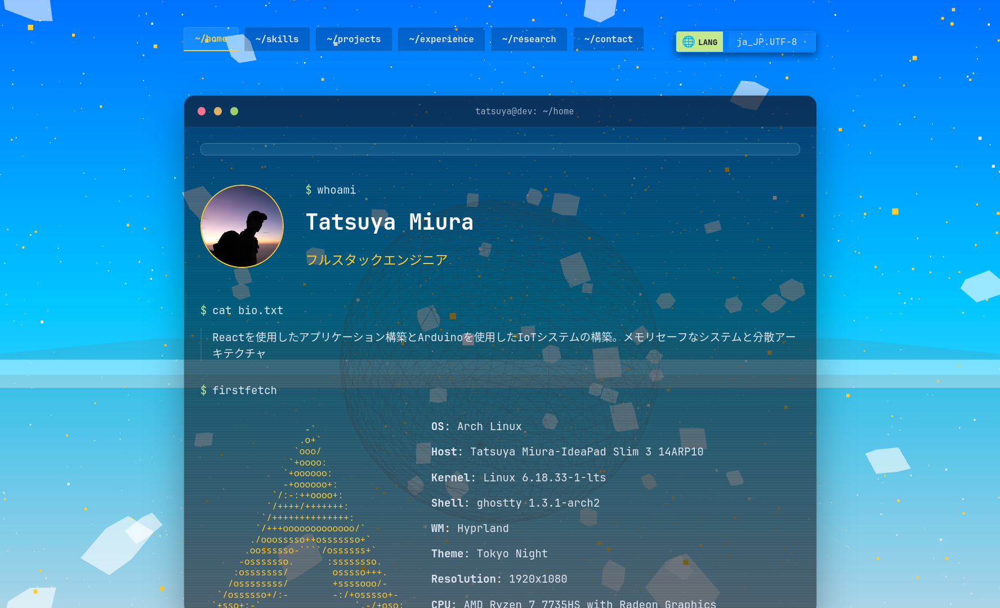

<<<<<<< HEAD
# TatsuyaM Portfolio (Hono && Bun && Odin edition)
[](https://www.kernel.org/)
[](https://archlinux.org/)
=======
# TatsuyaM Portfolio — Odin & WASM Edition
>>>>>>> a5e5da2 (README更新)



A personal portfolio website themed as an **interactive terminal emulator**, with a real-time **CPU-rendered day/night sky animation** powered by **Odin** compiled to **WebAssembly**.

---

## Table of Contents

- [Features](#features)
- [Architecture](#architecture)
- [WASM Background Animation](#wasm-background-animation)
- [Tech Stack](#tech-stack)
- [Quick Start](#quick-start)
- [Project Structure](#project-structure)
- [Commands](#terminal-commands)
- [Language Support](#language-support)
- [Theming](#theming)
- [Deployment](#deployment)
- [License](#license)

---

## Features

- **Terminal UI** — The entire site is a functional terminal. Navigate with `cd`, list files with `ls`, read content with `cat`, and discover easter eggs.
- **Odin/WASM Background** — A full day/night sky cycle with sun, stars, clouds, mountains, and water reflections, all rendered in real-time by Odin code compiled to WASM running on the CPU.
- **Interactive Ripples** — Mouse movement and clicks create water ripples in the WASM-rendered lake.
- **7 Languages** — English, Japanese, French, German, Chinese, Korean, and Italian with automatic browser language detection.
- **3 Color Themes** — Tokyo Night (default), Matrix, and Dracula.
- **Spotify Integration** — "Now Playing" widget showing current track with album art and progress bar.
- **Typewriter Effect** — Character-by-character text animation triggered by scroll visibility.
- **React 19** — Built with the latest React compiler for optimized performance.
- **Cloudflare Pages** — Deployed as a static site with Cloudflare Pages Functions for the API.

---

## Architecture

```
┌─────────────────────────────────────────────┐
│  Browser                                    │
│                                             │
│  ┌──────────┐  ┌──────────────────────────┐ │
│  │ React 19 │  │ <canvas>                 │ │
│  │ Terminal │  │                          │ │
│  │    UI    │  │  WASM (Odin)             │ │
│  │          │  │  render_frame(time)      │ │
│  │          │◄─┤  → RGBA pixel buffer     │ │
│  │          │  │  → putImageData()        │ │
│  └──────────┘  └──────────────────────────┘ │
│       │                                      │
│  ┌────▼─────┐                                │
│  │ Hono API │  (Cloudflare Pages Functions)  │
│  │ /api/*   │                                │
│  └──────────┘                                │
└─────────────────────────────────────────────┘
```

The Odin/WASM module is entirely self-contained — no host imports, no WebGL, no GPU shaders. It compiles to `freestanding_wasm32` and only uses `core:math`. The JS side instantiates the WASM module, calls `render_frame(time)` each frame, and blits the resulting pixel buffer to a `<canvas>` via `putImageData()`.

---

## WASM Background Animation

The background is a **complete landscape scene rendered entirely on the CPU** by 603 lines of Odin code (`core/main.odin`), compiled to WebAssembly.

### What It Renders

| Element | Description |
|---|---|
| **Sky** | 8-keyframe day/night cycle (deep night → dawn → sunrise → morning → noon → dusk → sunset → nightfall) with smooth color interpolation |
| **Sun** | Arc trajectory with 3-layer glow (core, halo, spread), atmospheric refraction near horizon |
| **Stars** | Rotating celestial sphere around a fixed pole, with anti-aliased circular glow and two brightness tiers |
| **Shooting Stars** | Deterministic meteors computed from hash functions — no mutable state needed |
| **Clouds** | Two-layer FBM (fractal Brownian motion): high-altitude wispy clouds + lower cumulus towers, with weather variation |
| **Mountains** | Pre-computed silhouette via FBM, cached per-column for efficient per-frame lookup |
| **Water** | Perspective-correct reflection of the sky with wave shimmer, sun glare lane, and interactive mouse ripples |
| **Horizon** | Warm glow band, haze band, and rim band for atmospheric effects |

### JS ↔ WASM Interface

The Odin module exports 6 functions:

```odin
get_width()        -> i32      // 512
get_height()       -> i32      // 384
get_buffer_ptr()   -> ^u8      // pointer to RGBA pixel buffer
init_noise()       -> void     // initialize noise texture + mountain cache
render_frame(t: f32) -> void   // render all pixels for time t (seconds)
spawn_ripple(x, y, t, strength) -> void  // create water ripple at (x, y)
```

### Performance

- **Resolution**: 512×384 (chosen for CPU rendering performance)
- **Frame Rate**: 30fps (throttled from JS via `requestAnimationFrame`)
- **Zero-copy**: JS reads the WASM pixel buffer directly as a `Uint8ClampedArray` view — no data copying
- **Day Length**: One full cycle = 480 seconds (8 minutes real time)
- **Parallax**: Canvas follows mouse position with smooth interpolation for depth effect

### Custom Fast Trig

The hot pixel loop uses polynomial-approximated `fast_sin`/`fast_cos` instead of library math functions for performance.

---

## Tech Stack

| Layer | Technology |
|---|---|
| **UI Framework** | React 19 + TypeScript |
| **WASM Engine** | Odin → `freestanding_wasm32` |
| **Styling** | CSS + Tailwind CSS 3 |
| **Animation** | Anime.js (UI transitions) |
| **Backend** | Hono (Bun runtime) |
| **i18n** | i18next + react-i18next |
| **Build** | Bun (`bun build`) |
| **Deploy** | Cloudflare Pages |
| **Linting** | ESLint 10 |

---

## Quick Start

### Prerequisites

- [Bun](https://bun.sh) ≥ 1.3
- [Odin compiler](https://odin-lang.org) (only needed if modifying `core/main.odin`)

### Development

```bash
# Install dependencies
bun install

# Start dev server (with hot reload)
bun run dev
```

### Production Build

```bash
bun run build
```

This runs 3 steps:
1. `build:css` — Compiles Tailwind CSS via `bunx tailwindcss`
2. Odin WASM compilation — `odin build core -target:freestanding_wasm32 -out:./public/main.wasm` (skipped on CI)
3. Frontend + Hono Functions — `Bun.build()` for React SPA and Cloudflare Pages Functions

---

## Project Structure

```
TatsuyaM-portfolio/
├── core/
│   └── main.odin                 # WASM landscape renderer (603 lines)
├── src/
│   ├── main.tsx                  # React entry point
│   ├── App.tsx                   # Terminal UI + command system
│   ├── App.css                   # Terminal + mobile styles
│   ├── index.css                 # Global CSS + theme definitions
│   ├── i18n.ts                   # i18next configuration
│   ├── components/
│   │   ├── Background.tsx        # WASM loader + canvas renderer
│   │   ├── TerminalWindow.tsx    # Terminal window chrome
│   │   ├── Typewriter.tsx        # Character-by-character animation
│   │   └── NowPlaying.tsx        # Spotify "Now Playing" widget
│   ├── pages/
│   │   ├── Home.tsx              # Profile, bio, education, awards
│   │   ├── Skills.tsx            # tree-style skill listing
│   │   ├── Projects.tsx          # Project showcase
│   │   ├── Experience.tsx        # journalctl-style career log
│   │   ├── Research.tsx          # Research topics
│   │   └── Contact.tsx           # finger-style contact info
│   ├── hooks/
│   │   └── useLanguage.tsx       # React context for i18n
│   ├── types/
│   │   └── portfolio.ts         # TypeScript interfaces
│   └── locales/                  # 7 language JSON files
├── server/
│   └── index.ts                  # Hono dev server
├── functions/api/
│   └── [[path]].ts               # Cloudflare Pages Functions
├── public/
│   ├── main.wasm                 # Pre-built Odin WASM binary
│   ├── index.html                # SPA shell
│   └── dist/                     # Built frontend assets
├── build.ts                      # Build orchestrator
└── package.json
```

---

## Terminal Commands

The site responds to these commands:

| Command | Description |
|---|---|
| `cd [home\|skills\|projects\|experience\|research\|contact]` | Navigate between pages |
| `ls -a` | List files (includes hidden files like `.secret_vault`) |
| `cat [bio.txt\|skills.json\|education.md\|...]` | Read content files |
| `fastfetch` | System info with ASCII Arch Linux logo |
| `ssh contact@tatsuya` | Show contact details |
| `theme [tokyo\|matrix\|dracula]` | Switch color theme |
| `lang [en\|ja\|fr\|de\|zh\|ko\|it]` | Change language |
| `sl` | Steam locomotive easter egg |
| `cmatrix` | Activate Matrix theme |
| `coffee` | ASCII art coffee cup |
| `sudo rm -rf /` | ...try it and see |
| `sudo pacman -syu` | Fake Arch Linux update |
| `secret` | Achievement unlocked! |

Use ↑/↓ arrow keys to navigate command history.

---

## Language Support

| Language | Code | Detection |
|---|---|---|
| English | `en` | Default fallback |
| 日本語 | `ja` | Auto-detected |
| Français | `fr` | Auto-detected |
| Deutsch | `de` | Auto-detected |
| 简体中文 | `zh` | Auto-detected |
| 한국어 | `ko` | Auto-detected |
| Italiano | `it` | Auto-detected |

Language detection powered by `i18next-browser-languagedetector`.

---

## Theming

Three themes available via `theme` command or the header dropdown:

| Theme | Accent | Prompt | Style |
|---|---|---|---|
| **Tokyo Night** (default) | `#ffcc33` | `#c3e88d` | Dark blue background |
| **Matrix** | `#00ff41` | `#00ff41` | Classic green-on-black |
| **Dracula** | `#bd93f9` | `#50fa7b` | Purple/pink Dracula palette |

---

## Deployment

### Cloudflare Pages

The project deploys to Cloudflare Pages. The build produces:

- `public/dist/` — Static frontend (React SPA + CSS + WASM)
- `functions/api/` — Cloudflare Pages Functions (Hono API)

The `public/_headers` file configures security headers including `wasm-unsafe-eval` in the Content-Security-Policy for WebAssembly execution.

### CI Build

On CI environments (where the Odin compiler is unavailable), the build skips WASM compilation and uses the pre-committed `public/main.wasm`.

---

## License

Custom Non-Commercial License — Copyright (c) 2026 TatsuyaM2667

Free for personal and non-commercial use with mandatory attribution to [@TatsuyaM2667](https://github.com/TatsuyaM2667). Commercial use is prohibited without written permission. See [LICENSE](LICENSE) for full terms.

---

## Author

**Tatsuya Miura** — [@TatsuyaM2667](https://github.com/TatsuyaM2667)

---

---

# TatsuyaM ポートフォリオ — Odin & WASM 版


**インタラクティブなターミナルエミュレータ**をテーマにした個人ポートフォリオサイト。背景には **Odin** で記述され **WebAssembly** にコンパイルされた、リアルタイムで **CPUレンダリングされる昼・夜の空のアニメーション** を搭載。

---

## 目次

- [特徴](#特徴)
- [アーキテクチャ](#アーキテクチャ)
- [WASM 背景アニメーション](#wasm-背景アニメーション)
- [技術スタック](#技術スタック)
- [クイックスタート](#クイックスタート)
- [プロジェクト構成](#プロジェクト構成)
- [ターミナルコマンド](#ターミナルコマンド)
- [言語対応](#言語対応)
- [テーマ](#テーマ)
- [デプロイ](#デプロイ)
- [ライセンス](#ライセンス)

---

## 特徴

- **ターミナル UI** — サイト全体が動作するターミナル。`cd` でナビゲーション、`ls` でファイル一覧、`cat` でコンテンツ閲覧、隠しコマンドも発見可能。
- **Odin/WASM 背景** — 太陽、星、雲、山、水の反射を含むフルデイ/ナイトサイクルの空を、Odin コードを WASM にコンパイルし CPU でリアルタイムレンダリング。
- **インタラクティブな波紋** — マウスの動きやクリックで WASM レンダリングされた湖に波紋が広がる。
- **7言語対応** — 英語、日本語、フランス語、ドイツ語、中国語、韓国語、イタリア語。ブラウザの言語を自動検出。
- **3カラーテーマ** — Tokyo Night（デフォルト）、Matrix、Dracula。
- **Spotify 連携** —「Now Playing」ウィジェットでアルバムアート、曲名、プログレスバーを表示。
- **タイプライター効果** — スクロール時に文字単位でテキストが表示されるアニメーション。
- **React 19** — 最新の React コンパイラで最適化されたパフォーマンス。
- **Cloudflare Pages** — 静的サイトとしてデプロイし、API は Cloudflare Pages Functions で処理。

---

## アーキテクチャ

```
┌─────────────────────────────────────────────┐
│  ブラウザ                                   │
│                                             │
│  ┌──────────┐  ┌──────────────────────────┐ │
│  │ React 19 │  │ <canvas>                 │ │
│  │ ターミナル│  │                          │ │
│  │    UI    │  │  WASM (Odin)             │ │
│  │          │  │  render_frame(time)      │ │
│  │          │◄─┤  → RGBA ピクセルバッファ   │ │
│  │          │  │  → putImageData()        │ │
│  └──────────┘  └──────────────────────────┘ │
│       │                                      │
│  ┌────▼─────┐                                │
│  │ Hono API │  (Cloudflare Pages Functions)  │
│  │ /api/*   │                                │
│  └──────────┘                                │
└─────────────────────────────────────────────┘
```

Odin/WASM モジュールは完全に自己完結しています。ホストインポートも WebGL も GPU シェーダーも使いません。`freestanding_wasm32` ターゲットにコンパイルされ、`core:math` のみを使用。JS 側は WASM モジュールをインスタンス化し、毎フレーム `render_frame(time)` を呼び、結果のピクセルバッファを `putImageData()` で `<canvas>` に描画します。

---

## WASM 背景アニメーション

背景は `core/main.odin` の **603行の Odin コードによって CPU 上で完全にレンダリングされるフルの風景シーン** です。

### 描画内容

| 要素 | 説明 |
|---|---|
| **空** | 8キーフレームのデイ/ナイトサイクル（深夜→夜明け→日の出→朝→昼→夕暮れ→日没→夜）の滑らかな色補間 |
| **太陽** | 円弧軌道、3層のグロー（コア、ヘイロー、広がり）、水平線付近での大気屈折 |
| **星** | 固定された天の北極周りの回転する天球、アンチエイリアス付きの円形グロー、2段階の明るさ |
| **流星** | ハッシュ関数から決定論的に計算される流星 — ミュータブルステート不要 |
| **雲** | 2層 FBM（フラクタル・ブラウン運動）: 高高度の巻雲 + 低高度の積乱雲、天候変動あり |
| **山** | FBM で事前計算されたシルエット、フレームごとの高速ルックアップ用に列ごとにキャッシュ |
| **水** | 空のパースペクティブ補正された反射、波のきらめき、太陽のグレーンレーン、マウスインタラクティブな波紋 |
| **水平線** | 暖かいグローバンド、ヒーズバンド、リムバンドによる大気効果 |

### JS ↔ WASM インターフェース

Odin モジュールがエクスポートする 6つの関数:

```odin
get_width()        -> i32      // 512
get_height()       -> i32      // 384
get_buffer_ptr()   -> ^u8      // RGBA ピクセルバッファへのポインタ
init_noise()       -> void     // ノイズテクスチャ + 山のキャッシュを初期化
render_frame(t: f32) -> void   // 時刻 t（秒）の全ピクセルをレンダリング
spawn_ripple(x, y, t, strength) -> void  // (x, y) に波紋を生成
```

### パフォーマンス

- **解像度**: 512×384（CPU レンダリング性能を考慮した選択）
- **フレームレート**: 30fps（JS 側で `requestAnimationFrame` によりスロットリング）
- **ゼロコピー**: JS は WASM ピクセルバッファを `Uint8ClampedArray` ビューとして直接読み込み — データコピーなし
- **1日の長さ**: 1サイクル = 480秒（リアルタイム8分）
- **視差効果**: キャンバスがマウス位置に追従し、滑らかな補間で奥行きを演出

### カスタム高速三角関数

ピクセルループのホットパスでは、ライブラリの数学関数の代わりに多項式近似の `fast_sin`/`fast_cos` を使用し、パフォーマンスを最適化しています。

---

## 技術スタック

| レイヤー | 技術 |
|---|---|
| **UI フレームワーク** | React 19 + TypeScript |
| **WASM エンジン** | Odin → `freestanding_wasm32` |
| **スタイリング** | CSS + Tailwind CSS 3 |
| **アニメーション** | Anime.js（UI トランジション） |
| **バックエンド** | Hono（Bun ランタイム） |
| **i18n** | i18next + react-i18next |
| **ビルド** | Bun（`bun build`） |
| **デプロイ** | Cloudflare Pages |
| **リンティング** | ESLint 10 |

---

## クイックスタート

### 前提条件

- [Bun](https://bun.sh) ≥ 1.3
- [Odin コンパイラ](https://odin-lang.org)（`core/main.odin` を変更する場合のみ）

### 開発

```bash
# 依存関係をインストール
bun install

# 開発サーバーを起動（ホットリロード付き）
bun run dev
```

### プロダクションビルド

```bash
bun run build
```

3つのステップが実行されます:
1. `build:css` — `bunx tailwindcss` で Tailwind CSS をコンパイル
2. Odin WASM コンパイル — `odin build core -target:freestanding_wasm32 -out:./public/main.wasm`（CI ではスキップ）
3. フロントエンド + Hono Functions — `Bun.build()` で React SPA と Cloudflare Pages Functions をビルド

---

## プロジェクト構成

```
TatsuyaM-portfolio/
├── core/
│   └── main.odin                 # WASM 風景レンダラー（603行）
├── src/
│   ├── main.tsx                  # React エントリーポイント
│   ├── App.tsx                   # ターミナル UI + コマンドシステム
│   ├── App.css                   # ターミナル + モバイルスタイル
│   ├── index.css                 # グローバル CSS + テーマ定義
│   ├── i18n.ts                   # i18next 設定
│   ├── components/
│   │   ├── Background.tsx        # WASM ローダー + キャンバスレンダラー
│   │   ├── TerminalWindow.tsx    # ターミナルウィンドウの外观
│   │   ├── Typewriter.tsx        # 文字単位のアニメーション
│   │   └── NowPlaying.tsx        # Spotify「Now Playing」ウィジェット
│   ├── pages/
│   │   ├── Home.tsx              # プロフィール、経歴、受賞歴
│   │   ├── Skills.tsx            # tree 形式のスキル一覧
│   │   ├── Projects.tsx          # プロジェクトショーケース
│   │   ├── Experience.tsx        # journalctl 形式のキャリアログ
│   │   ├── Research.tsx          # 研究トピック
│   │   └── Contact.tsx           # finger 形式の連絡先情報
│   ├── hooks/
│   │   └── useLanguage.tsx       # i18n 用 React コンテキスト
│   ├── types/
│   │   └── portfolio.ts         # TypeScript インターフェース
│   └── locales/                  # 7言語 JSON ファイル
├── server/
│   └── index.ts                  # Hono 開発サーバー
├── functions/api/
│   └── [[path]].ts               # Cloudflare Pages Functions
├── public/
│   ├── main.wasm                 # 事前ビルド済み Odin WASM バイナリ
│   ├── index.html                # シェル
│   └── dist/                     # ビルド済みフロントエンドアセット
├── build.ts                      # ビルドオーケストレーター
└── package.json
```

---

## ターミナルコマンド

サイトは以下のコマンドに応答します:

| コマンド | 説明 |
|---|---|
| `cd [home\|skills\|projects\|experience\|research\|contact]` | ページ間をナビゲート |
| `ls -a` | ファイル一覧（`.secret_vault` などの隠しファイル含む） |
| `cat [bio.txt\|skills.json\|education.md\|...]` | コンテンツファイルを読み取り |
| `fastfetch` | ASCII Arch Linux ロゴ付きシステム情報 |
| `ssh contact@tatsuya` | 連絡先情報を表示 |
| `theme [tokyo\|matrix\|dracula]` | カラーテーマを切り替え |
| `lang [en\|ja\|fr\|de\|zh\|ko\|it]` | 言語を変更 |
| `sl` | 蒸気機関車のイースターエッグ |
| `cmatrix` | テーマを Matrix に変更 |
| `coffee` | アスキーアートのコーヒーカップ |
| `sudo rm -rf /` | ...試してみてください |
| `sudo pacman -syu` | ダミーの Arch Linux アップデート |
| `secret` | アチーブメント解除！ |

↑/↓ 矢印キーでコマンド履歴を navigating できます。

---

## 言語対応

| 言語 | コード | 検出方法 |
|---|---|---|
| English | `en` | フォールバック言語 |
| 日本語 | `ja` | 自動検出 |
| Français | `fr` | 自動検出 |
| Deutsch | `de` | 自動検出 |
| 简体中文 | `zh` | 自動検出 |
| 한국어 | `ko` | 自動検出 |
| Italiano | `it` | 自動検出 |

`i18next-browser-languagedetector` による自動言語検出。

---

## テーマ

`theme` コマンドまたはヘッダーのドロップダウンで 3つのテーマを利用可能:

| テーマ | アクセント | プロンプト | スタイル |
|---|---|---|---|
| **Tokyo Night**（デフォルト） | `#ffcc33` | `#c3e88d` | ダークブルー背景 |
| **Matrix** | `#00ff41` | `#00ff41` | クラシックなグリーン・オン・ブラック |
| **Dracula** | `#bd93f9` | `#50fa7b` | パープル/ピンクの Dracula パレット |

---

## デプロイ

### Cloudflare Pages

Cloudflare Pages にデプロイ。ビルド成果物:

- `public/dist/` — 静的フロントエンド（React SPA + CSS + WASM）
- `functions/api/` — Cloudflare Pages Functions（Hono API）

`public/_headers` ファイルでセキュリティヘッダーを設定。WebAssembly 実行のために Content-Security-Policy に `wasm-unsafe-eval` を含んでいます。

### CI ビルド

CI 環境（Odin コンパイラが利用不可）では、WASM コンパイルをスキップし、事前コミット済みの `public/main.wasm` を使用します。

---

## ライセンス

カスタム非営利ライセンス — Copyright (c) 2026 TatsuyaM2667

個人および非営利目的での利用は [@TatsuyaM2667](https://github.com/TatsuyaM2667) へのクレジット条件で無料。商用利用は書面による許可なしに禁止。詳細は [LICENSE](LICENSE) を参照。

---

## 作者

**Tatsuya Miura** — [@TatsuyaM2667](https://github.com/TatsuyaM2667)
